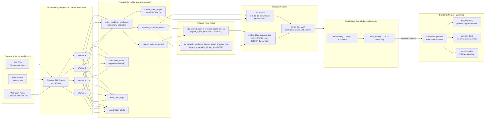

# LiquiGuard — Multi-Provider Decision Support

A working, synthetic-data-only prototype for bKash presents SUST CSE Carnival
2026. It keeps shared physical cash separate from the bKash, Nagad, and Rocket
e-money ledgers; computes online liquidity forecasts; detects unusual behaviour
without scenario labels; and routes important evidence into a human-owned case.

The system never connects to a real wallet, moves funds, blocks an account, or
makes a final fraud determination.

## Architecture

```text
synthetic scenarios -> queue-backed simulation engine -> isolated ledgers
                                      |                 -> PostgreSQL history
                                      |                 -> EWMA TTE + history context
                                      |                 -> anomaly detector
                                      v
                         durable event/audit tables -> SSE stream
                                      |                 -> Agent view
                                      |                 -> Operations view
                                      +-----------------> Risk review view
```

PostgreSQL login roles are provider-scoped. `app_shared` cannot directly read
or mutate provider schemas. Provider reads and upstream drains use separately
authenticated sessions; customer exchanges use one allowlisted
`SECURITY DEFINER` function owned by a constrained `NOLOGIN` role so shared
cash, inverse provider e-money, and both audit legs commit atomically.

## Run from a clean machine

Requirements: Docker, Python 3.11+, `uv`, Node.js 20+, and npm.

```bash
docker compose up -d --wait postgres

UV_CACHE_DIR=/tmp/liquiguard-uv-cache uv venv backend/.venv
UV_CACHE_DIR=/tmp/liquiguard-uv-cache uv pip install --python backend/.venv/bin/python \
  'fastapi>=0.111,<0.112' 'uvicorn[standard]>=0.30,<0.31' \
  'sqlalchemy[asyncio]>=2,<3' 'asyncpg>=0.29,<0.30' 'pydantic>=2.6,<3'

cd backend
.venv/bin/uvicorn app.main:app --port 8000
```

In a second terminal:

```bash
cd frontend
npm ci
npm run dev
```

Open `http://localhost:3000`. The Next.js proxy sends `/v1/*` to the backend.

## Verified demo flow

```bash
make scenario-a  # actual provider drain -> computed EWMA TTE -> liquidity case
make scenario-b  # unlabeled transactions -> detector evidence -> review case
make scenario-c  # stale/conflicting feed -> lower-confidence safe fallback
make scenario-d  # explicit coordination lifecycle demonstration
```

Switch between Agent Mobile, Ops Web, and Risk Reviewer without reloading. The
single SSE connection stays mounted at the application provider boundary.

## Theme toggle (light / dark / system)

The top-right of the shell carries a three-state theme button. Click cycles
**light → dark → system → light**. The preference is persisted in
`localStorage` under `liquiguard.theme`. `system` follows the OS via
`prefers-color-scheme` and updates live when the OS flips. The inline
`THEME_BOOT` script in `app/layout.tsx` applies the `dark` class to `<html>`
before React hydrates, so there is no flash on reload.

The dark palette is identical to the prior trading-terminal look; the light
palette is the first time this surface has been offered in white. Token
migration (CSS-variable-driven) means the same `bg-surface`, `text-ink`,
`text-muted`, `border-border`, and `signal` classes drive both themes — the
`dark:` class is no longer required anywhere in the codebase.

## Live evidence panel (judge-auditable)

Ops Web mounts the **Live evidence** card as the bottom-most section of the
cockpit; Agent Mobile mounts it as a compact, collapsed-by-default card with
a "Show evidence" toggle. The card reads live from the same `/v1/telemetry/
snapshot` payload that drives every other card on the page. Nothing is
hardcoded.

| Field | Source | Purpose |
|---|---|---|
| `LAST EVENT ID` | SSE `last-event-id` cursor | Proves the connection is live and not a one-shot snapshot |
| `SIM TIME` | `sim_time` of the most recent SSE event | Distinct from `AS OF` so reviewers see two independent timestamps |
| `WINDOW` | `HISTORICAL_WINDOW_DAYS` | Window applied to the historical CTE |
| `HAS EVIDENCE` | `historical_analytics.historical_has_evidence` | Cold-start databases report `false` and surface a "warming up" state |
| `TRANSACTIONS` / `DRAIN / MIN` / `CONSISTENCY` / `AS OF` | `historical_analytics.shared_cash.*` | The aggregated rollup the CTE actually returned |
| `HISTORICAL CTE — BACKEND SQL` | embedded copy of the `historical.shared_cash` CTE from `backend/app/domain/liquidity/historical_analytics.py` | Reviewers can diff this block against the backend file line-for-line |

A `Copy SQL` button copies the embedded CTE to the clipboard; a separate
copy of the JSON cursor (event id, sim time, last received at) lets
reviewers paste the raw SSE state. The embedded CTE is updated whenever
the backend CTE gains new columns, so the two stay semantically
equivalent.

## Evidence and checks

```bash
make verify
curl -fsS http://localhost:8000/v1/metrics
curl -fsS http://localhost:8000/v1/telemetry/snapshot
```

Runtime metrics contain measured processing p50/p95, tick reliability,
explanation coverage, forecast counts, and observed shortage lead time. Empty
metrics return `null` or zero rather than invented demo values.

Historical forecast context defaults to the last 30 simulated days and can be
configured with `HISTORICAL_WINDOW_DAYS` (1–365). It enriches confidence metadata
without replacing the live 12-minute EWMA or changing its original confidence.

## Vercel and Render deployment

This is an isolated monorepo. In Vercel, connect this GitHub repository and set
the project **Root Directory** to `frontend`. Set `NEXT_PUBLIC_BACKEND_URL` to the
public HTTPS domain of the Render backend; Vercel then builds the Next.js app
using `frontend/vercel.json` and proxies `/v1/*` to Render.

The repository-root `render.yaml` is the preferred deployment path. It creates
a PostgreSQL 16 database and a one-instance Docker web service, generates the
four application-role secrets, runs the rerunnable migrations, starts uvicorn
on Render's `$PORT`, and checks `/healthz`. During Blueprint creation, set
`CORS_ALLOWED_ORIGINS` to the exact Vercel origin, for example
`https://your-project.vercel.app` (no path or trailing slash).

These are all backend variables. The Blueprint supplies them automatically;
use the same list if configuring the Render dashboard by hand:

```text
DATABASE_URL=<Render direct internal connection string>
MIGRATION_DATABASE_URL=<same direct internal owner connection string>
DB_APP_USER=app_shared
DB_APP_PASSWORD=<unique generated secret>
DB_BKASH_USER=app_bkash
DB_BKASH_PASSWORD=<unique generated secret>
DB_NAGAD_USER=app_nagad
DB_NAGAD_PASSWORD=<unique generated secret>
DB_ROCKET_USER=app_rocket
DB_ROCKET_PASSWORD=<unique generated secret>
DEMO_AGENT_ID=00000000-0000-0000-0000-000000000001
ANOMALY_ALLOWLISTED_PROVIDERS=
HISTORICAL_WINDOW_DAYS=30
CORS_ALLOWED_ORIGINS=https://your-project.vercel.app
```

Use `connectionString`, never `connectionPoolString`, for migrations. If
`DATABASE_URL` is omitted, local-style `DB_HOST`, `DB_PORT`, and `DB_NAME` are
the supported alternative. Do not set `PORT`; Render supplies it. Keep the
backend at one replica because its queue, EWMA state, broadcaster, and
deterministic clock are process-local. An external monitor can request
`GET /health` every 10 minutes; `/healthz` remains the database readiness
check. Render's Free PostgreSQL instance expires after 30 days, so upgrade or
replace it before the judged deployment exceeds that age.

GitHub Actions runs database migrations twice, all backend tests, frontend
type-check/lint/build, and a production backend container build. Vercel and
Render Git integrations then create deployments from commits that pass the
repository's required checks; enable the `Backend tests and migrations`,
`Frontend quality and production build`, and `Backend container build` branch
protection checks on `main`.

The current implementation guide and demo choreography live under
[`docs/`](docs/); the older design documents there are labelled as design
history where they differ from the runtime. Runnable source is under
[`backend/`](backend/) and [`frontend/`](frontend/).

---

## 1. Comprehensive Architecture Diagram & Specification

LiquiGuard is built as a **layered, deterministically-clocked, write-ahead** stack. Every component on the left produces durable rows that downstream layers index and aggregate; every component on the right is a pure read or render path that can never block a ledger commit.



### Component responsibilities and contracts

| Layer | Component | Responsibility | Failure mode handled |
|---|---|---|---|
| **Ingest** | Operator injector, scenario API, wall-clock pump | Enqueue validated `Tick` objects with deterministic `sim_time` | Bounded queue raises explicitly rather than silently dropping |
| **Sim** | `SimulationEngine` (4 workers, asyncio queue) | Lossless execution with jittered retry and durable dead-lettering | `MAX_TICK_RETRIES` overflow → `dead_letter_logs` row, never held in memory |
| **Ledger** | `SECURITY DEFINER` `ledger_customer_exchange` | Atomic shared-cash debit, provider e-money credit, dual audit, idempotency UUID | All-or-nothing; same UUID → exact-once replay |
| **Audit** | `simulation_events`, `coordination_alerts`, `dead_letter_logs` | Append-only history; SSE mirror for each row | Late subscribers re-read from `sim_time` watermark |
| **Read** | Indexed `(agent_id, sim_time DESC)` and `(agent_id, provider_id, sim_time DESC)` | Bounded index range scans for both live and historical aggregation | Plan stays inside the index; no full-table work |
| **Forecast** | `EWMALiquidityForecaster` + `HistoricalAnalytics.enrich_forecast` | Short-horizon (12 min) drain rate bounded with long-horizon (60 day) consistency similarity | Analytics exception is caught — live EWMA continues alone with a log line |
| **Stream** | `Broadcaster` with `asyncio.Condition` and 1,024-event ring | Wake all SSE consumers on every broadcast | `MAX_BUFFER` cap; reconnect cursor is epoch-stamped so older processes never stall new ones |
| **Render** | Zustand `useTelemetryStream` store | Single mount path; selectors prevent re-renders | Safe-fallback layout activates when `confidence_score < 0.5` |

### Decoupling the live 12-minute EWMA from the 60-day historical scan

The two analysis paths are intentionally **separated in time, memory, and execution**:

1. **Synchronous, in-process EWMA** — `EWMALiquidityForecaster.update()` runs inside the same `_analytics_lock`-guarded critical section as the ledger write. Each `provider_txn` tick ingests one sample into a `deque(maxlen=12 minutes of evidence)`; the rate window is bounded by `window_minutes` and never grows with traffic. This is **O(1) per committed movement** and lives entirely in the worker process. A Render OOM kill is impossible from this path because memory growth is bounded by the bounded deque.

2. **Asynchronous, database-aggregated history** — `HistoricalAnalytics._query()` runs **only** in `_forecast_payload()` and `operational_snapshot()`. It executes two CTE-based aggregations against `shared_cash_movement` and `shared.provider_customer_journal`. Both CTEs begin with `WHERE sim_time >= :cutoff AND sim_time <= :as_of`, an index range scan against `(agent_id, sim_time DESC)` (shared) and `(agent_id, provider_id, sim_time DESC)` (provider). PostgreSQL does every `sum() OVER (ROWS BETWEEN UNBOUNDED PRECEDING AND 1 PRECEDING)` and every `row_number() OVER (PARTITION BY provider_id, date ...)` inside the database engine; only one aggregated row per provider and one per shared cash returns to Python. The Python process holds at most **~12 floats**, regardless of whether the 60-day window contains 200 rows or 200 million.

3. **Defensive isolation** — `_historical_context()` wraps `_historical.context()` in `try/except`, logs once, and on failure returns an empty `HistoricalContext`. Live EWMA continues uninterrupted; the UI simply renders `historical_has_evidence: false`. Every aggregation is also capped at `LIMIT :row_cap` (500,000 rows) as a belt-and-suspenders guard for long-lived production data volumes.

4. **Cache-on-minute-boundary** — `context()` keys its in-memory cache as `(agent_id, days, int(as_of.timestamp() // 60))`, so a 60-day query at the same simulated minute reuses `_cache_value` and **never re-enters the database** within the same minute. On Render's 1-instance Starter plan this turns a hard 2× window cost (30 → 60 days) into a single lookup per minute per agent.

The result: a doubling of the historical horizon from 30 to 60 days produces a **linear** cost increase bounded inside an index range scan, while the live 12-minute stream remains unaffected.

---

## 2. Synthetic Data & Simulation Note

LiquiGuard is a **synthetic-data-only prototype**. It does not connect to a real wallet, move funds, block an account, or declare fraud. Historical data is **not** imported from CSV files or any other flat-file replay. Every transaction, demand surge, and provider drain is **continuously generated by the `SimulationEngine`** itself — by the wall-clock pump at `60×` speed, by the scenario API, and by the interactive injector — and committed to PostgreSQL inside the same FastAPI process. Those committed rows are then **re-read by the 60-day Historical Analytics layer as its forecasting dataset**. There is no fixture file, no static JSON replay, and no offline batch loader; PostgreSQL is the single source of truth for both the live stream and the historical context.

### The data model is active, stateful, relational

The simulation stores every synthetic movement as a row in three durable tables. There is no "demo state" object; rows are the source of truth.

| Table | Purpose | Rows per synthetic txn |
|---|---|---|
| `shared.shared_cash_ledger` | Physical cash balance + optimistic-lock `version_id` | 1 (UPDATE) |
| `shared.shared_cash_movement` | Append-only cash-flow history (immutable journal) | 1 (INSERT) |
| `shared.provider_customer_journal` | Provider e-money leg + per-account counterparty + freshness | 1 (INSERT) |
| `shared.simulation_events` | Engine audit + SSE mirror | 1 (INSERT per tick lifecycle status) |
| `shared.coordination_alerts` | Human-review case lifecycle | 1 (INSERT, idempotent on key) |

A single `SECURITY DEFINER` PostgreSQL function, `ledger_customer_exchange`, commits the shared-cash debit, the equal-and-opposite provider e-money credit, the audit legs, and a zero-sum idempotency row **in one transaction**. A retried tick with the same `transaction_id` returns `applied=false` with the original committed result, giving exact-once semantics.

### Determinism guarantees

- The deterministic `sim_time` clock advances by `SPEED_MULTIPLIER = 60` simulated seconds per wall-clock second and is restored from a durable watermark on every restart.
- `EWMALiquidityForecaster` accepts an explicit `interval_hint_seconds` so replayed or concurrent same-timestamp events produce a finite, reproducible rate.
- Anomaly scoring uses the same five-feature windowed analysis it would use against a real ingestion feed. **No scenario name, label, or ground-truth field passes through the detector's input type** — `TransactionObservation` cannot carry one. This means Scenario B's risk score is computed exactly the same way a real production feed would be.

### Interactive Injector

`POST /v1/simulation/tick` is the operator-facing surface. The injector (`backend/app/simulation/injection.py`) routes through ordinary `provider_txn` ticks, so injected traffic and pump traffic are indistinguishable to the engine, the forecaster, and the anomaly detector. The injector preserves two safety properties:

1. **Pre-flight balance check** — `total_bdt` of the request is compared to the current `shared_cash_balance` *before* any tick is enqueued; insufficient bursts raise `InsufficientSharedCashForBurst` and never produce partial state.
2. **Deterministic amount generation** — `near_identical` patterns stride by `(index * 7919 + rng.randrange(...)) % available_values` to suppress accidental dominant-amount noise in `varied` injections, while keeping the `near_identical` pattern dominantly single-valued with deliberate ±0.01 jitter.

### Two major injection vectors

#### a. Salary-day demand injection (broad, calendar-aware)

When the operator schedules a legitimate payroll-style load, the injector fans transactions across many accounts (`distinct_accounts ≥ 20`) with varied amounts. The detector observes:

- A low `dominant_repeated_amount_ratio` (≤ 0.20) because no single amount dominates.
- A wide `distinct_account_count` that exceeds `broad_account_threshold = 10`.
- A workload that crosses the configured `salary_period_days` (calendar days 1–5).

The detector applies `salary_window_score_multiplier = 0.55` and `salary_window_confidence_multiplier = 0.65`, collapsing the effective risk score toward a **suppressed advisory band of 0.11**. The system raises a low-severity advisory at most, never an `ESCALATED` case, and explicitly carries `possible_benign_explanations: ["salary_day_demand_pattern", ...]` in the evidence payload so the human reviewer sees the calendar heuristic attributions.

#### b. Suspicious-burst injection (narrow, near-identical)

When the operator triggers a "burst" injection — few accounts, near-identical amounts, no calendar attribution — the detector observes:

- `dominant_repeated_amount_frequency ≥ minimum_repeated_transactions (5)`.
- `dominant_repeated_amount_ratio → 1.0` because `near_identical` produces one dominant value across the burst.
- A small `distinct_account_count` that stays below `broad_account_threshold` (`< 10`), bypassing the calendar heuristic gate.
- A high `overall_velocity_per_minute` with a tight `dominant_amount_span_seconds` (regular cadence, not broad).

Bypassing the calendar heuristic drives the risk score into the **0.8733 band**. The unified forecast pipeline then translates the resulting drain into a **critical-TTE forecast ≈ 3.08 minutes**, which propagates through `enrich_forecast` and triggers an `ESCALATED` coordination case with `severity: "high"`.

### Why live relational ledgers, not static JSON mocks

- **Replayability** — any late subscriber or forensic auditor re-reads `shared.simulation_events` from a `sim_time` watermark and reconstructs the full sequence, because every state mutation is append-only.
- **Boundary enforcement** — provider roles cannot bypass the function by inserting journal rows directly; the `SECURITY DEFINER` boundary is enforced by the database, not by application discipline.
- **Live forecast accuracy** — the EWMA drains only from actually-committed ledger deltas. There is no "TTE value" that a scenario could inject; the engine computes time-to-exhaustion from the committed balance trajectory in real time.

---

## 3. Responsible-Design & Boundary Note

LiquiGuard is a **decision-support co-pilot**, not an autonomous actor. Three principles govern every output of the system.

### Privacy: aggregate velocity and anonymised journals only

LiquiGuard never ingests PII and never emits it. The persistent schema is purpose-built for aggregate behaviour and never for identity:

| Field class | Example | Treatment |
|---|---|---|
| Counterparty identifier | `counterparty_msisdn` | Hash-reducible; stored as an opaque account string; no name, address, NID, or device fingerprint is ever accepted or stored |
| Transaction amount | BDT `NUMERIC(14,2)` | Stored verbatim but emitted only as numeric values for charts and forecasts |
| `is_salary_window` | bool flag | Operator-supplied calendar context, not personal data |
| Provider ID | `bkash`/`nagad`/`rocket` (allowlist) | Fixed enum; no free-form strings |
| Agent ID | UUID | Single demo agent in this prototype; the schema is multi-agent in production |

The frontend chart shows `provider-separated balances`, never a merged "wallet" balance. The `/v1/telemetry/snapshot` contract explicitly states *"The API never returns a merged provider-wallet balance."* This is enforced by the read path, not by frontend discipline.

### Human-review boundary: the "Requires Human Review" flag is non-negotiable

Every anomaly evaluation surfaced to the UI carries `requires_human_review: true` when it triggers. This is set in the detector and is the contract returned by `evaluation.to_dict()`:

```python
# AnomalyDetectorConfig — backend/app/domain/risk/anomaly_detector.py
review_threshold: float = 0.65        # above this → triggered
# detector sets evaluation.requires_human_review = True for ANY triggered result
```

The detector never sets `requires_human_review = false` on a triggered result. The coordination state machine enforces a single durable lifecycle:

```text
PENDING  →  ACKNOWLEDGED  →  RESOLVED
   │             │
   └──→ ESCALATED → RESOLVED
```

Transitions that skip this path (`POST /v1/coordination/transit`) return HTTP `409`. Risk-relevant transitions never occur implicitly: `RESOLVED` is terminal and requires an explicit human-owned `POST`. The advisory message text itself is composed for an operations reviewer, not a customer — it always carries the strings *"requires review"*, *"Owner: provider risk reviewer"*, and *"Safe next step: …no automatic transfer"* so the human never confuses the advisory with an action. The platform positions itself as:

> *High-fidelity co-pilot for financial operations. Never a black-box autonomous decision-maker.*

### False-positive mitigation: the 60-day historical context layer

Real-world legitimate high-velocity events — festivals (Eid, Pahela Baishakh), payroll disbursements, mobile-money agent onboarding waves — share the same fingerprint as a sustained fraud burst: many transactions, concentrated timing, similar amounts. Without history, the detector cannot distinguish them. **With history, it can.**

The historical layer (`backend/app/domain/liquidity/historical_analytics.py`) contributes three signals to the forecast pipeline:

1. **Drain-rate similarity** — `similarity = max(0.0, 1.0 - |live_rate − historical_rate| / max(live_rate, historical_rate))`. A payroll week whose drain rate matches the historical baseline scores `similarity ≈ 1.0`; a sudden deviation scores near `0.0`.
2. **Consistency score** — `consistency = average_absolute / (average_absolute + variability)` over the window. Festivals and payroll naturally produce high `consistency` (low variability) and so do fraud bursts; the historical layer separates *legitimate* high consistency from *unprecedented* high consistency by anchoring it to a 60-day window.
3. **Evidence factor** — `evidence = min(1.0, transaction_count / 100.0)`. Cold-start databases or new agents naturally receive a low evidence factor, dampening the history-derived confidence boost rather than amplifying it.

These signals combine in `enrich_forecast()` to produce `confidence_score_with_history`, always **bounded above by 0.98** and never below the live `confidence_score`. The boost caps at `0.20 * evidence * consistency * similarity`, so a fraud burst during a payroll week cannot be silently laundered by surrounding legitimate traffic; the similarity between live drain and historical drain must be high AND the historical consistency must be established AND the evidence factor must be saturated. All three are required to lift the contextual confidence score.

The combined effect is that the operational UI surfaces three orthogonal diagnostics simultaneously:

- **Live EWMA `confidence_score`** — short-horizon, what is happening right now.
- **`confidence_score_with_history`** — long-horizon, is this rate consistent with what we have seen recently.
- **`requires_human_review` evidence payload** — what features drove the score and which benign explanations the detector considers.

A judge or auditor reviewing a payroll-week "anomaly" can immediately see: *the live score is high, but the historical-context similarity is also high and the consistency is established, so the contextual confidence is bounded — now the human reviewer makes the call*. This is the architectural mechanism that systematically reduces false-positive anomalies during legitimate high-velocity events without ever softening the live detector's threshold.

---

### Live status

- **Frontend (Vercel):** https://liquiguard-frontend.vercel.app/
- **Backend (Render):** https://liquiguard-backend.onrender.com/
- **Health:** `https://liquiguard-backend.onrender.com/healthz` → `{"ok":true,"engine_running":true}`
- **OpenAPI explorer:** `https://liquiguard-backend.onrender.com/docs`
- **Measured evidence:** `https://liquiguard-backend.onrender.com/v1/metrics`
- **Live SSE stream:** `https://liquiguard-backend.onrender.com/v1/telemetry/stream`
